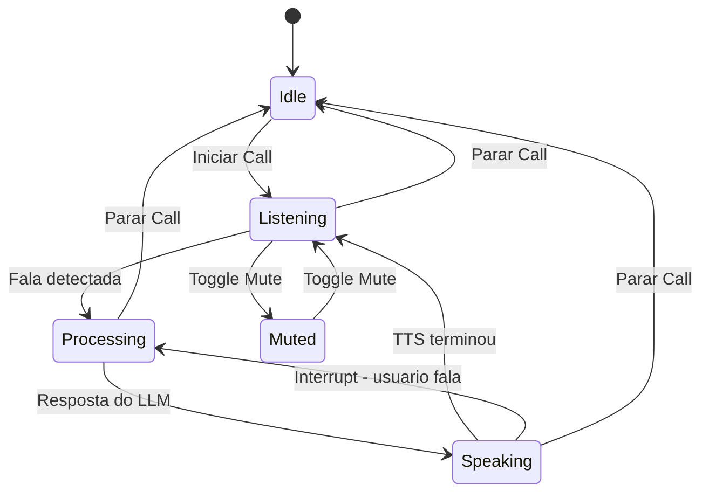

# Plano de Correção: Fluxo de Voz (STT → LLM → TTS)

## Contexto

O projeto usa arquitetura **texto-a-texto**:
- **STT**: Web Speech API (`useSpeechRecognition.ts`)
- **LLM**: Gemini 3.1 Flash Lite REST API (`useChatAPI.ts`)
- **TTS**: Inworld TTS API (`inworldTTS.ts`)

O problema central: **não há echo cancellation nem interrupt** — o STT captura a própria fala do TTS, e não há como parar o áudio.

## Problema Principal: STT Escuta a Própria Fala do TTS

Na Live API antiga, o modelo gerenciava isso automaticamente. Agora precisamos implementar manualmente:

1. **Pausar STT enquanto TTS fala** — evita capturar a própria voz
2. **Retomar STT quando TTS termina** — volta a escutar o usuário
3. **Interrupt**: se o usuário fala durante TTS, parar o TTS e processar a fala
4. **Stop**: ao clicar parar, matar tudo imediatamente

## Diagrama do Fluxo Corrigido

## Correções Necessárias

### 1. AudioManager Singleton em inworldTTS.ts
- Manter referência global ao `Audio` atual
- Expor `stopSpeaking()` para parar áudio imediatamente
- Expor `isPlaying()` para verificar estado
- Suportar `AbortController` para cancelar fetch TTS em andamento

### 2. Remover TTS do useChatAPI.ts
- O hook deve ser APENAS texto: enviar mensagem → receber resposta
- Remover `synthesizeSpeech` interno e `isSpeaking` state
- TTS fica 100% controlado pelo App.tsx

### 3. Corrigir useSpeechRecognition.ts
- `stopListening`: usar `abort()` + destruir instância para parada garantida
- Setar `isListeningRef = false` ANTES de abort para evitar restart no onend
- Adicionar `pauseListening` e `resumeListening` para controle durante TTS

### 4. Refatorar Fluxo no App.tsx
- Ao receber fala do STT: **pausar STT** → enviar ao LLM → receber resposta → **falar TTS** → **retomar STT**
- Ao clicar Parar: `stopSpeaking()` + `abort STT` + `disconnectChat`
- Ao clicar Mute: parar STT + resetar transcript
- Ao clicar Unmute: resetar transcript + iniciar STT
- Speaker OFF: pular TTS, retomar STT imediatamente

### 5. Conectar Speaker Toggle
- Se speaker OFF durante fala: chamar `stopSpeaking()` + retomar STT
- Se speaker OFF antes de falar: pular TTS

### 6. Seletor de Vozes e Instruções no Menu Settings
- Já implementado: nome do preset de instruções aparece no menu
- Vozes Gemini já têm seletor funcional
- Pendente: seletor de vozes TTS Inworld no Settings

## Arquivos a Modificar

| Arquivo | Mudanças |
|---------|----------|
| `utils/inworldTTS.ts` | AudioManager singleton com stopSpeaking, isPlaying, AbortController |
| `hooks/useChatAPI.ts` | Remover TTS interno, manter apenas texto |
| `hooks/useSpeechRecognition.ts` | abort + destroy, pauseListening/resumeListening |
| `App.tsx` | Coordenar STT↔TTS: pausar STT durante TTS, interrupt, conectar speaker |

## Ordem de Implementação

1. `utils/inworldTTS.ts` — AudioManager singleton
2. `hooks/useChatAPI.ts` — Remover TTS
3. `hooks/useSpeechRecognition.ts` — Melhorar stop/pause/resume
4. `App.tsx` — Refatorar fluxo completo
5. Testar
