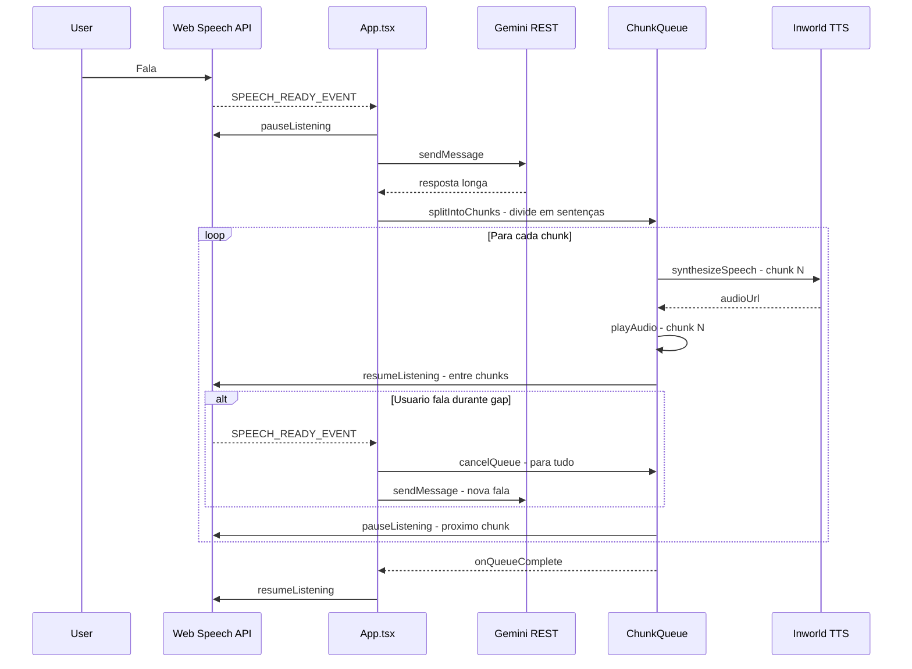

# Plano V2: TTS Chunked + Interrupt + Function Calling + Vozes

## Problemas Identificados nos Testes

### 1. TTS demora para textos longos
O TTS gera o áudio inteiro de uma vez. Textos longos demoram muito para começar a reproduzir.
**Solução**: Dividir texto em sentenças/chunks e gerar áudio em paralelo, reproduzindo conforme ficam prontos.

### 2. Sem interrupt real
O STT é pausado durante TODO o TTS. O usuário não consegue interromper a fala.
**Solução**: Manter STT ativo ENTRE chunks. Se o usuário falar, cancelar a fila de chunks restantes.

### 3. Sem lista de vozes TTS no seletor
O campo Voice ID é um input de texto livre. Deveria carregar a lista de vozes da API.
**Solução**: Usar `listVoices()` da API e mostrar seletor dropdown.

### 4. Skills/Function Calling não funciona
O `useChatAPI` atual usa `generateContent` simples sem `tools`. Ghost search, show_image, etc. não são chamados.
**Solução**: Adicionar `tools` ao request e processar `functionCall` na resposta.

### 5. Thinking/Budget não configurado
Modelos lite precisam de configuração de thinking para funcionar bem.
**Solução**: Adicionar `thinkingConfig` ao `generationConfig`.

## Arquitetura do TTS Chunked com Interrupt



## Detalhamento das Mudanças

### 1. TTS Chunked em inworldTTS.ts

Adicionar ao AudioManager:
- `speakChunked(text, secretKey, voiceId, model, callbacks)` — divide texto em sentenças
- Fila interna de chunks com estados: pending, fetching, playing, done, cancelled
- `cancelQueue()` — cancela todos os chunks pendentes
- Callbacks: `onChunkStart`, `onChunkEnd`, `onQueueComplete`, `onInterruptWindow`
- O `onInterruptWindow` é chamado ENTRE chunks — é quando o STT deve ser ativado brevemente

**Algoritmo de split**:
```
1. Dividir por sentenças: . ! ? \n
2. Agrupar sentenças curtas (< 50 chars) com a próxima
3. Limitar cada chunk a ~200 chars max
4. Primeiro chunk menor (~100 chars) para resposta rápida
```

**Pipeline de prefetch**:
```
1. Iniciar fetch do chunk 1 imediatamente
2. Enquanto chunk 1 toca, fazer prefetch do chunk 2
3. Assim que chunk 1 termina, chunk 2 já está pronto
```

### 2. Interrupt Real no App.tsx

Refatorar o `handleSpeechReady`:
- Se TTS está tocando e STT detecta fala → chamar `cancelQueue()` → processar nova fala
- O STT fica ativo brevemente entre chunks (janela de ~500ms)
- Se detectar fala nessa janela, cancelar fila e processar interrupt

### 3. Seletor de Vozes TTS no SettingsScreen.tsx

Na seção de Account > Configuração de Voz TTS:
- Quando o usuário tem secret key configurada, carregar lista de vozes via `listVoices()`
- Mostrar dropdown/lista com vozes disponíveis em vez de input de texto
- Manter input de texto como fallback se API falhar

### 4. Function Calling no useChatAPI.ts

Adicionar ao `sendMessage`:
- Importar `buildFunctionDeclarations` do skillsStore
- Adicionar `tools` ao body do request
- Processar `functionCall` na resposta
- Loop de tool calling: se resposta tem functionCall → executar → enviar resultado → obter resposta final
- Suportar ghost_search, show_image, hide_image, fetch_page, etc.

### 5. Thinking Config

Adicionar ao `generationConfig` no useChatAPI:
```json
{
  "thinkingConfig": {
    "thinkingBudget": 1024
  }
}
```

## Ordem de Implementação

1. **inworldTTS.ts** — `speakChunked()` com fila, prefetch, e `cancelQueue()`
2. **App.tsx** — Usar `speakChunked` em vez de `speakText`, implementar interrupt entre chunks
3. **useChatAPI.ts** — Adicionar function calling com tools e loop de tool execution
4. **SettingsScreen.tsx** — Seletor de vozes TTS dinâmico
5. **useChatAPI.ts** — Adicionar thinkingConfig ao generationConfig

## Arquivos a Modificar

| Arquivo | Mudanças |
|---------|----------|
| `utils/inworldTTS.ts` | `speakChunked()`, fila de chunks, prefetch, `cancelQueue()` |
| `App.tsx` | Usar speakChunked, interrupt entre chunks, STT ativo entre chunks |
| `hooks/useChatAPI.ts` | Function calling com tools, loop de tool execution, thinkingConfig |
| `components/SettingsScreen.tsx` | Seletor de vozes TTS dinâmico com listVoices() |
